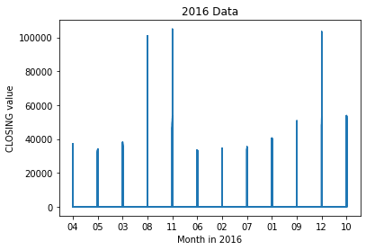
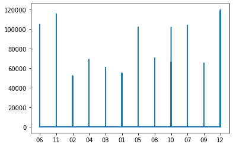
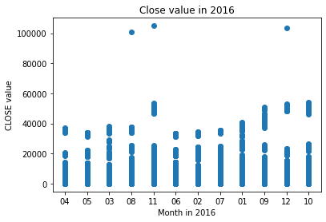
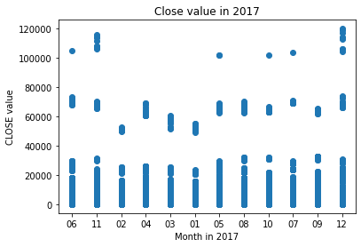
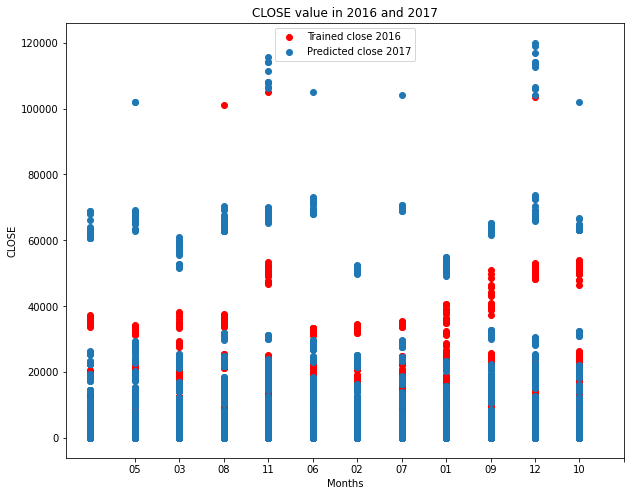

  <h1>
<b> 
Report on National Stock Exchange(NSE) data from 2016 & 2017 
</b>
  </h1>

<b>
ABSTRACT
</b>

The Project is to develop a suitable machine learning algorithm to predict the statistical arbitrage opportunities in NSE data. From the dataset given in this link, wherein the data consisted from the year range of 2016 and 2017. The data from 2016 was labelled as training set and 2017 data as the test set for the machine learning model. 

<b>
INTRODUCTION
</b>

A Linear Regression machine learning model was used to fit the 2016 training set data. Considering the nature of the NSE data, the feature ‘CLOSE’ being the final output value that one requires was deemed to be the output label to be predicted in this model. Based on this feature ‘CLOSE’, which is the closing value of that timestamped day, a correlation matrix was created, to see the relationship among other features, as shown in table 1.

.png)

<b>
INTERPRETATION & ANALYSIS
</b>

Thus, from table 1, it is assumed that closing has a high positive relationship with features HIGH and LAST; so, when CLOSE value increases there is a correlated increase in HIGH and LAST value which is logically fitting. On the other end, TOTTRDQTY and TOTALTRADES has a high negative relationship with closing value. Therefore, it is assumed from said correlations that stocks with generally closing value stock prices do not tally with high trading in bulk quantities, thus inferring that the closing period of the NSE does not have many people buying stocks during this time, as it’s considered too volatile. 

<b>
Modelling Linear Regression over the dataset:
</b>

On fitting the Linear Regression model based on the 2016 training set. The 2017 data was used to predict the closing values. From the Linear Regression prediction model, there was a prediction score accuracy of 98%. Hence the model is deemed to be a good fitting model

From the predicted closing values of the test set visualized models were created as shown below.

From graph 1, between each month’s closing values are plotted, reminding this is the training set. Where seeing the graph, month 11(November) and 12(December) of 2016 have the highest closing values of over 100,000. 

Graph 2, shows the 2017 predicted closing values, where months 12(December) and 11(November) similarly have the highest closing values. As both 2016 and 2017 have similar months having the highest closing values. 

From graph 1 and graph 2, it shows monthly, but an entire month cannot have the same high value. Hence a scatter plot is used as shown in graph 3.

From graph 3, it is seen that the said high closing values of month 11 and month 12 have a have most of the closing values population below 60,000, and only few closing values above the previously shown 100,000 mark. Hence showing that there are only spikes in the stock values, and this may not be taken in as a general overall trend in the NSE market. 

But the drastic change from 2016 model and the 2017 closing values is seen, wherein there is overall increase in the closing values where, there is a initial phase in the initial periods of a month, when  there is low closing values, but a pattern of similar stock closing values of under 80,000 emerges throughout the year, the third phase in which there is an almost 120,000 closing values. Hence there is a stark difference between the 2016 and 2017 dataset model. 

<b>
CONCLUSION
</b>

To conclude, from the multiple graphs and correlation tables, and analysis from them using the machine learning Linear Regression model has shown the peaks of monthly stock values, and the general trends in monthly fluctuations throughout the year. Using this model, future NSE models may also be easily created using the simple Linear Regression model as presented in the Github repository.  

